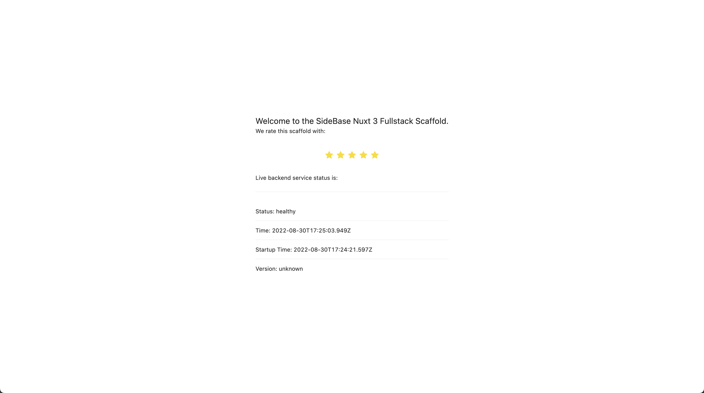

# SideBase



SideBase bootstraps a nuxt 3 project that permits developing a backend and a frontend using just nuxt 3. We want to show the world how enjoyable end-to-end typescript programming can be, displacing the myth that JS/TS-backends are no good. If you have any problems with this project (e.g., setting it up on your PC) [open an issue](https://github.com/sidestream-tech/sidebase/issues/new/choose) and we'll figure it out 🎉

The application code is inside the `app/` folder. Read more [in it's README](./app/README.md). This scaffold provides out of the box:
- a functional nuxt 3 setup (see in `app/`),
- a functional backend with:
    - database connection (sqlite for easy development, can be switched out when going into production)
    - testing
- breakpoint debugging
- `Base` database model that can be usefully extended by project typeorm-classes
- VS Code plugin recommendations for the best development experience (DX)


## Development

```sh
> cd app
> npm i
> npm run dev
```

Then visit [localhost:3000](http://localhost:3000) to see the webapp or [localhost:8081](http://localhost:8081) to see the database UI.

Many more things are possible (and useful for development). To:
- perform component development via `storybook`,
- run `test`s,
- run `lint`ing,
- see how to get a debugger with breakpoints running

or execute further, other commands, please have a look at the more detailed [readme of the fullstack app](./app/README.md).
