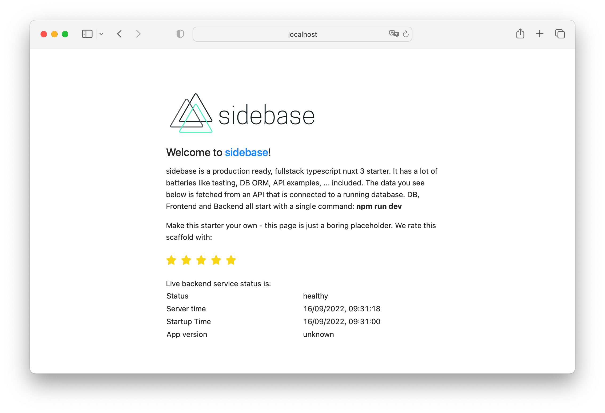

# sidebase

> With **sidebase** every new project feel like a fun side-project while scaling to production.

sidebase is a modern, best-practice, batteries-included fullstack-app starter based on Nuxt 3 and TypeScript.

## Quick start

1. Clone the repository
    ```sh
    git clone https://github.com/sidestream-tech/sidebase my-app
    ```
2. Go into the `app/` directory
    ```sh
    cd my-app/app
    ```
3. Install the dependencies
    ```sh
    npm i
    ```
4. Start developing (with database, backend, API, ... running) at [localhost:3000](http://localhost:3000)
    ```sh
    npm run dev
    ```

## Features

The key features are:
- 🎒 **Fullstack**: Develop frontend and backend in a single TypeScript code base
    - Fullstack [`Vue 3`](https://vuejs.org/) + [`Nuxt 3 RC.9`](https://v3.nuxtjs.org/),
    - Data base models, migrations, queries and easy DB-switching via [`TypeORM`](https://typeorm.io/),
    - Frontend- and Backend data-transformation via [`nuxt-sidebase-parse`](https://www.npmjs.com/package/@sidestream-tech/nuxt-sidebase-parse) and [`zod`](https://github.com/colinhacks/zod),
    - In-memory development SQL-database via [`sqlite3`](https://www.sqlite.org/index.html),
    - Linting via [`eslint`](https://eslint.org/),
    - Test management, Test UI, component snapshotting via [`vitest`](https://vitest.dev/),
    - Component tests via [`test-library/vue`](https://testing-library.com/),
    - API tests via [`supertest`](https://github.com/visionmedia/supertest),
    - Code coverage via [`c8`](https://github.com/bcoe/c8),
    - Component stories via [`histoire`](https://histoire.dev/),
    - CSS utiltities via [`TailwindCSS`](https://tailwindcss.com/),
    - CSS components via [`Ant Design Vue`](https://antdv.com/components/overview),
    - Type checking in script and template via [`Volar / vue-tsc`](https://github.com/johnsoncodehk/volar)
- 🏎️ **Fast to code**: Database, example tests, example components and example pages are all there for you to fill out
- 🐛 **Fewer bugs**: Strong data-validation using `zod` to validate all transferred data, fully typed API-routes, strict DB models via `TypeORM`
- 😊 **Easy to use**: Designed to follow best practices and to be ready-to-go for development, without additional dev-dependencies like `docker` that make it hard to get started
- 🚀 **Ready for launch**: Github Actions CI, Dockerfile, easy switch to most popular SQL-databases are all there, out of the box ([get in touch if you're missing something](https://github.com/sidestream-tech/sidebase/issues/new/choose))

**Have fun**, as [Atinux, CEO of Nuxt](https://github.com/Atinux) said:
> Beautiful work on Sidebase!

To facilitate this `sidebase` bootstraps a nuxt 3 project that permits developing a backend and a frontend using just Nuxt 3 with overarching TypeScript support. We want to show the world how enjoyable end-to-end typescript programming can be, displacing the myth that JS/TS-backends are no good. This starter solves a lot fo the "real-world" problems that occur after you start using Nuxt or any other framework: How to write backend tests? How to write component tests? How to calculate test coverage? How to integrate a database? How to build a docker image? ...?

If you have any problems with this project (e.g., setting it up on your PC) [open an issue](https://github.com/sidestream-tech/sidebase/issues/new/choose) and we'll figure it out together with you 🎉

## Commands and Further Documentation

You can also:
- `npm run story` for isolated component development using `histoire` (see [`ShowCase.story.vue`](./app/components/example/ShowCase.story.vue) as example)
- `npm run test` for testing (see [`ShowCase.test.ts`](./app/components/example/ShowCase.test.ts) as example)
    - `npm run test -- -u` to update the component snapshots
    - `npm run test -- -t "test describe text"` to run a specific test
    - `npm run test:ui` to start the [vitest UI](https://vitest.dev/guide/ui.html)
- `npm run lint` for linting using `eslint`
- `npm run build` for bundling using `vite`

Have a look at the more detailed [readme of the fullstack app](./app/README.md) to see a broader, more in-depth explanation and documentation of commands.

### Guides

1. Use [`nuxt-sidestream-parse`](https://www.npmjs.com/package/@sidestream-tech/nuxt-sidebase-parse) to validate and deserialize data from the `server` in the `frontend`:
    - Define a zod-schema for the response of your endpoint, [like so](./app/server/schemas/healthz.ts):
        ```ts
        import { z } from '@sidestream-tech/nuxt-sidebase-parse'
        import { transformStringToDate } from './helpers'

        export const responseSchemaHealthCheck = z.object({
        status: z.literal('healthy'),
        time: z.string().transform(transformStringToDate),
        startupTime: z.string().transform(transformStringToDate),
        nuxtAppVersion: z.string(),
        })

        export type ResponseHealthcheck = z.infer<typeof responseSchemaHealthCheck>

        ```
    - Define an endpoint that returns complex data (e.g.: date-objects), [like so](./app/server/api/healthz.get.ts):
        ```ts
        import { createError, defineEventHandler } from 'h3'
        import { AppDataSource } from '../database'
        import type { ResponseHealthcheck } from '../schemas/healthz'

        const startupTime = new Date()

        export default defineEventHandler((): ResponseHealthcheck => {
        if (!AppDataSource.isInitialized) {
            console.error('Healthcheck failed: DB connection not initialized')
            throw createError({ statusCode: 500 })
        }

        return {
            status: 'healthy',
            time: new Date(),
            startupTime,
            nuxtAppVersion: process.env.NUXT_APP_VERSION || 'unknown',
        }
        })
        ```
    - Call it from the frontend, get free data validation, derserialization (e.g.: string-date is transformed to `Date` object) and typing, [like so](./app/pages/index.vue):
        ```ts
        import { makeParser } from '@sidestream-tech/nuxt-sidebase-parse'
        import { responseSchemaHealthCheck } from '~/server/schemas/healthz'

        const transform = makeParser(responseSchemaHealthCheck)
        const { data, refresh, error } = await useFetch('/api/healthz', { transform })
        ```
    - That's it! `data` will be fully typed AND all data inside will be de-serialized, so `time` will be a `Date`-object, and not a string, that you first need to deserialize
    - If an `error` is thrown, it's done using nuxt [`createError`](https://v3.nuxtjs.org/api/utils/create-error/), so it works well in frontend and on the server. `data` will be null in that case. You can find zod-details about your error in `error.data`
2. Use [`nuxt-sidestream-parse`](https://www.npmjs.com/package/@sidestream-tech/nuxt-sidebase-parse) to validate data that the user has passed to your API endpoint:
    - Parse user data like this:
        ```ts
        import { defineEventHandler } from 'h3'
        import type { CompatibilityEvent } from 'h3'
        import { parseBodyAs, z } from '@sidestream-tech/nuxt-sidebase-parse'

        export default defineEventHandler(async (event: CompatibilityEvent) => {
            // Parse the payload using the update schema. The parsing is important to avoid bad, incorrect or malicious data coming in
            const payload = await parseBodyAs(event, z.object({
                requestId: z.string().uuid(),
                pleaseDoubleThisNumber: z.number()
            }))

            return {
                requestId: payload.requestId,
                doubledNumber: 2 * payload.pleaseDoubleThisNumber
            }
        })
        ```
    - Other helpers like `parseQueryAs`, `parseCookiesAs`, `parseParamsAs`, ... are defined in `@sidestream-tech/nuxt-sidebase-parse`. See a bigger [example here](./app/server/api/example/%5Bid%5D.patch.ts)
